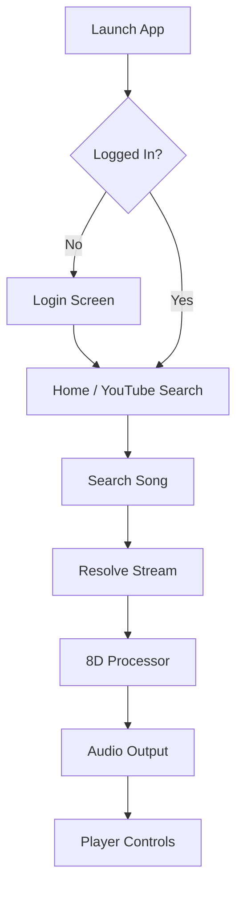

# VibeCaster — 8D Audio Experience

VibeCaster is a premium Android music player designed to transform your listening experience with real-time 8D audio effects, bass boost, and seamless YouTube/Audius integration.

## 🚀 Features

- **8D Audio Engine**: Real-time spatial audio rotation with adjustable speed and depth.
- **YouTube Integration**: Search and stream millions of songs directly.
- **Offline Mode**: Download your favorite tracks for offline playback.
- **Equalizer**: Dedicated Bass and Treble controls.
- **Modern UI**: Material 3 design with dynamic "Vibe" palettes.
- **Sleep Timer**: Automatically stop music after a set duration.
- **Lyrics Support**: Integrated lyrics fetching for most tracks.

## 🏗️ Project Structure

```text
app/src/main/java/com/vibecaster/
├── data/               # Repositories for Local, YouTube, Audius, and Playlists
├── player/             # Media3 / ExoPlayer implementation and Audio Processors
├── ui/                 # Jetpack Compose Screens and Theme
│   ├── AppRoot.kt      # Main navigation and entry point
│   ├── PlayerScreen.kt # Full-screen 8D player
│   └── YouTubeScreen.kt# YouTube search and discovery
├── youtube/            # YouTube stream resolution (NewPipe Extractor)
└── MainViewModel.kt    # Central state management
```

## 🔄 App Flow Diagram



## 🛠️ Installation & Build

### Requirements
- Android Studio Ladybug or newer
- Android SDK 31+
- Java 17

### How to Build a Signed Release
1. **Generate Keystore**: Go to `Build > Generate Signed Bundle / APK`.
2. **Configuration**: Use the following credentials (pre-configured in `build.gradle.kts`):
   - Key Alias: `vibe-alias`
   - Password: `password`
3. **Run Task**: Execute `./gradlew assembleRelease` to generate the APK in `app/build/outputs/apk/release/`.

## ⚠️ Known Issues & Fixes

### YouTube Resolve Failed (NoSuchMethodError)
If you encounter a `NoSuchMethodError` related to `URLDecoder.decode` on older Android versions:
1. Ensure **Core Library Desugaring** is enabled in `build.gradle.kts`.
2. The project uses `desugar_jdk_libs_nio:2.1.4` to backport Java 11 APIs used by the NewPipe Extractor.
3. Make sure to use **API 33+** for the best experience, though desugaring supports down to **API 21**.

## 🤝 Contributing
Push your changes to the repository and create a Pull Request. For release builds, ensure you have the `vibe-key.jks` in the `app` folder.

---
*Developed with ❤️ for the 8D Music Community.*
